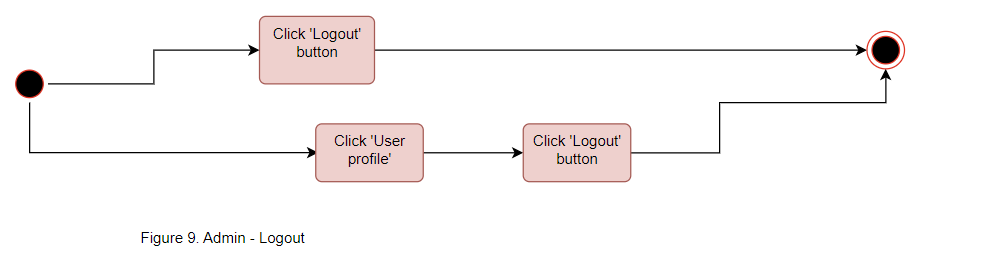

# vgupe2023_team7
## Project: [VGU Online Bus ticket Booking System](PE2023 - team 7 - Project Proposal.pdf)

## Members: 
 1. Vũ Hoàng Tuấn Anh (18812): @vhta - UID: 13789984 - (Leader)
 2. Bá Nguyễn Quốc Anh (17965): @anhba17965 - UID: 13834118
 3. Trần Kim Hoàn (18810): @tkimhoan89 - UID: 13834801
 4. Trương Hoàng Nam (17273): @Requiem5032 - UID: 13789675
 5. Nguyễn Hoàng Hải Nam (17035): @huni101 - UID: 13841983

## Project Description

- #### Project title: 
    VGU Online Bus Ticket Booking System


- #### Overview: 
    Online Bus Ticket Booking Web App is a user-friendly web application for VGU students and staff. VGU students as users are provided online QR Bus tickets after booking. The application will also enable VGU staff as administrators to manage and modify all the Information of the bus schedule, and the price of the ticket. Drivers could check the validity of the tickets by scanning QR codes.

- #### Project Report Document
    - The Report Document is located in the folder [**ReportDocument**](ReportDocument/)

    - **Markdown version:**
        - [Repository local file](ReportDocument/Team-7-Project-Report.md)
        - [Gitlab Wiki Page](https://gitlab.com/galvdat/vgu_tinyprojects/pe2023/vgupe2023_team7/-/wikis/Team-7-Project-Report)
    - **PDF version:**
        - [Repository local file](ReportDocument/PE2023_Team7_ProjectReport.pdf)
        - [Online Report Document Viewer](https://drive.google.com/file/d/1p67ykhe4eX7x6kO1BOAdxYMtobJVEv3M/view)

## Project Architecture

#### Languages, Framework

 [![HTML][HTML.html]][HTML-url]
 [![CSS][CSS.css]][CSS-url]
 [![Bootstrap][Bootstrap.css]][Bootstrap-url]
 [![Less][Less.js]][Less-url]
 [![SASS][SASS.css]][SASS-url]
 [![JavaScript][JavaScript.js]][JavaScript-url]
 [![PHP][PHP.php]][PHP-url]
 [![MySQL][MySQL.db]][MYSQL-url]

#### MVC Architecture (Model View Controller) 
 <br>

<br>
 <br>

- #### Model:
    - is a part of the application that represents the data.
    - Client (bus drivers, students) view include all the UI components such as login-page, dashboard.

- #### View:
    - is a part of the application that process the user interaction.
    - The controller will interprets the mouse and keyboard inputs from the user then request the model and view to change as appropriate.
    - When the user login to the system, a system send’s commands to the model to update the UI to the dashboard contain information of that user, if the user change anything, the controller will send commands to the model to update that user information in the database.

- #### Controller:
    - is a part of storing data and its related logic.
    - When a Controller retrieves the students bus ticket information from the database. The model manipulates data and sends it back to the database or uses it to render bus ticket information information to the students.

#### Built With

 [![Docker][Docker.dockerfile]][Docker-url] 

#### Use Cases Diagram


#### Use Cases Diagram
- Student
    - Login 
    - View Account Information 
    - Change Password 
    - View Tickets 
    - View Notifications 
    - Book A Ticket 
    - Logout 

- Admin
    - Login 
    - View Account Information 
    - Change Password 
    - Change Ticket Price 
    - Send Notifications 
    - Add A Ticket 
    - View Bus Data 
    - View Ticket Data 
    - Logout 

- Driver
    - Login 
    - View Account Information 
    - Scan QR Ticket 
    - View Notifications 
    - Change Password 
    - Logout 


#### Sequence Diagram


#### Entity Relationship Diagram


## Project Setup

#### Requirement
- Docker Engine [(Download Link)](https://www.docker.com/)
- Any Internet browser application: Google Chrome (recommend), Firefox, Microsoft Edge, Opera, Safari, Brave, Chromium etc...

#### Clone the repository
Clone the repo using git

- SSH
    ```bash
    git clone git@gitlab.com:galvdat/vgu_tinyprojects/pe2023/vgupe2023_team7.git
    ```

- HTTPS
    ```bash
    git clone https://gitlab.com/galvdat/vgu_tinyprojects/pe2023/vgupe2023_team7.git
    ```
or simply download the .zip file of the project

#### Open the project
- First, you have to locate the project by going to the folder location [Your_Root_Folder_Location]/Finalize/ <br>
    

- Make sure that Docker Engine has been already running in your system, then open the current folder in terminal (Terminal could be one of these: Powershell, Bash Shell, CMD Prompt, etc...) <br>
    

- Before the next step, make sure that there is no application on your systems are using any 1 of the 3 following ports: **80**, **3307**, and **8081** since our project needs to use these 3 ports for:
    - Web interface: port 80
    - MySQL Database: port 3307
    - phpMyAdmin: port 8081

        - **For Windows**, to check whether a process is running on a specific port, we use this command on Powershell:
    
            ```bash
            Get-Process -Id (Get-NetTCPConnection -LocalPort <PORT_NUMBER>).OwningProcess
            ```
            where <_PORT_NUMBER_> is a parameter 
            
            For example, we want to check if there exists a process running on port 3307 in our system:
            ```bash
            Get-Process -Id (Get-NetTCPConnection -LocalPort 3307).OwningProcess
            ```

            Then if there exists a process running on port 3307, we have to stop this process in order to run the project. Use this command:

            ```bash
            taskkill /PID <PID> /F
            ```
            where <_PID_> is a parameter, which is the Process ID of the process 

            For example, if we want to stop the process which has the PID 19721, we use this command:

            ```bash
            taskkill /PID 19721 /F
            ```
            <br>

        - **For Linux (Debian, Ubuntu)** to check whether a process is running on a specific port, we use this command on Terminal:
            ```bash
            sudo lsof -i TCP:<PORT_NUMBER>
            ```
            where <_PORT_NUMBER_> is a parameter 

            Then if we want to stop a process, we have to use this command:
            ```bash
            sudo kill -9 <PID>
            ```
            where <_PID_> is a parameter, which is the Process ID of the process 
        
- Type this command line on the terminal to run the project containers, the Docker Engine will then automatically download the necessary images for the project
    ```bash
    docker-compose up
    ```
#### Configure the database
- To access the GUI of the database management system, we need to type the following URL in the address bar of any browser and then press Enter (Here I use Google Chrome): 

    ```
    localhost:8081
    ```
    It will look like this:

    

- Then we log in to the MySQL Database System by using the following information:
    ```
    Username: root
    Password: 12345
    ```
    It will look like this:

    

- Next, find the Database name **_vgubusdb_** in the database list on the left side bar, select it and go to the **Import** section

    

- In the **_File to import:_** diagbox, we select the **_Choose File_** and then browse for the **_vgubusdb.sql_** SQL schema file (in the folder [Finalize/db_schema](Finalize/db_schema/)). After that, we click **_Import_** to start importing database schema for **_vgubusdb_** database 

    

- Now the **_vgubusdb_** database has already been imported from the file. If the **_vgubusdb_** has the following tables and data, the import process is successful, and the database system is ready for use. 

    

#### Log in to the Bus Ticket Booking System
- To access the main web app, we need to type the following URL in the address bar of any browser and then press Enter (Here I use Google Chrome): 

    ```
    http://localhost/view/login.php
    ```
    It will look like this:

    

    Here are some sample default accounts for you to test:

    Student 1:
    ```
    User ID: 17965
    Password: 987654321   
    ```

    Student 2:
    ```
    User ID: 18810
    Password: 123456789
    ```

    Student 3:
    ```
    User ID: 18812
    Password: 123456789
    ```


    Admin
    ```
    User ID: admin10
    Password: 123456789
    ```

    Driver
    ```
    User ID: driver20
    Password: 123456789
    ```


For more information, please read carefully the [**ReportDocument PDF**](ReportDocument/PE2023_Team7_ProjectReport.pdf) or [**ReportDocument MD**](ReportDocument/Team-7-Project-Report.md) (or [PDF online file](https://drive.google.com/file/d/1p67ykhe4eX7x6kO1BOAdxYMtobJVEv3M/view))


<!-- All Links -->
[HTML.html]: https://img.shields.io/badge/HTML5-E34F26?style=for-the-badge&logo=html5&logoColor=white
[HTML-url]: https://html.spec.whatwg.org/
[CSS.css]: https://img.shields.io/badge/CSS3-1572B6?style=for-the-badge&logo=css3&logoColor=white
[CSS-url]: https://www.w3.org/TR/CSS/#css
[JavaScript.js]: https://img.shields.io/badge/JavaScript-F7DF1E?style=for-the-badge&logo=javascript&logoColor=black
[JavaScript-url]: https://www.ecma-international.org/publications-and-standards/standards/ecma-262/
[PHP.php]: https://img.shields.io/badge/PHP-777BB4?style=for-the-badge&logo=php&logoColor=white
[PHP-url]: https://www.php.net/
[MySQL.db]: https://img.shields.io/badge/MySQL-005C84?style=for-the-badge&logo=mysql&logoColor=white
[MySQL-url]: https://www.mysql.com/
[Docker.dockerfile]: https://img.shields.io/badge/dockerhub-images-important.svg?logo=Docker
[Docker-url]: https://www.docker.com/
[Bootstrap.css]: https://img.shields.io/badge/Bootstrap-563D7C?style=for-the-badge&logo=bootstrap&logoColor=white
[Bootstrap-url]: https://getbootstrap.com/
[Less.js]: https://img.shields.io/badge/less-2B4C80?style=for-the-badge&logo=less&logoColor=white
[Less-url]: https://lesscss.org/
[SASS.css]: https://img.shields.io/badge/SASS-hotpink.svg?style=for-the-badge&logo=SASS&logoColor=white
[SASS-url]: https://sass-lang.com/