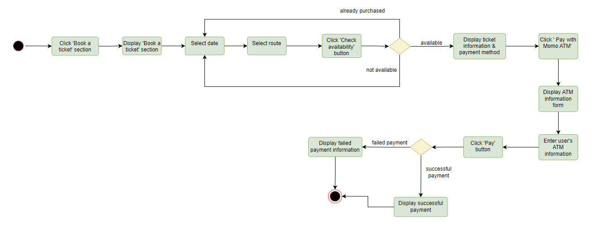
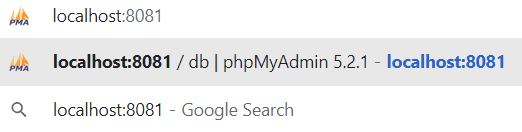
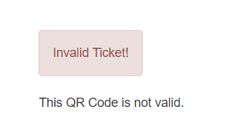

## Online Bus Ticket Booking System

Instructor: Prof. Huynh Trung Hieu <br>
Students: <br>
Vũ Hoàng Tuấn Anh (18812) <br> 
Trần Kim Hoàn (18810) <br> 
Bá Nguyễn Quốc Anh (17965) <br> 
Trương Hoàng Nam (17273) <br> 
Nguyễn Hoàng Hải Nam (17035) <br> 

##### BINH DUONG, MAY 2023


## Member list & Workload

Our team has 5 members and we together decide to split the total workload into proper parts equally. Each
member is responsible for the work as below:

|   No   |      Full name        | ID     | Percentage of work   |
|------  | ----------------      | ------ | ---------            |
|   1    | Vu Hoang Tuan Anh     | 18812  | 100%                 |
|   2    | Tran Kim Hoan         | 18810  | 100%                 |
|   3    | Ba Nguyen Quoc Anh    | 17965  | 100%                 |   
|   4    | Truong Hoang Nam      | 17273  | 100%                 |
|   5    | Nguyen Hoang Hai Nam  | 17035  | 100%                 |

- **Vu Hoang Tuan Anh** (Leader, full-stack developer, database specialist, tester)
    - Suggesting the main idea of the project
    - Designing the Use-cases Diagram v
    - Designing the Entity Relationship Diagram v
    - Designing the User-dashboard front-end interface
    - Designing functions for the backend server
    - Researching Google API (QR code, Captcha) and implememnt
    - Researching Payment Gateway API (Momo ATM payment gateway) and implement
    - Fixing major backend function bugs
    - Fixing GUI bugs
    - Generating sample data for database server
    - Updating the database schema
    - Writing the Report document
- **Tran Kim Hoan** (front-end developer, database manager, tester)
    - Designing the Activity Diagram
    - Designing the Use-cases Diagram v
    - Designing the front-end prototype
    - Designing the Entity Relationship Diagram v
    - Designing the User-dashboard front-end interface
    - Generating sample data for database server
    - Testing the application to find possible bugs
    - Writing the Report document
- **Ba Nguyen Quoc Anh** (full-stack developer)
    - Designing the Use-cases Diagram
    - Designing the front-end Landing page
    - Designing the front-end ’Log in’ page
    - Designing the User-dashboard front-end interface
    - Designing functions for the backend server
    - Researching QR Code Scanner module and implement
    - Updating backend functions
    - Writing the Report document
- **Truong Hoang Nam** (database specialist, tester)
    - Designing the Use Cases Diagram v
    - Designing the Entity Relationship Diagram v
    - Designing the Database Schema
    - Generating sample data for database server
    - Testing the application to find possible bugs
- **Nguyen Hoang Hai Nam** (back-end developer, database manager)
    - Designing the Sequence Diagram
    - Generating sample data for database server
    - Researching for the Payment Gateway API
    - Writing the Report document


## Contents


- 1 Project Description Contents
- 2 Abstract
- 3 Acknowledgement
- 4 Introduction
   - 4.1 Objective
   - 4.2 Audience
   - 4.3 Project Scope
   - 4.4 Constraints
- 5 Product Backlog
- 6 Project Overview
   - 6.1 Overall Architecture
   - 6.2 Use Case Diagrams
   - 6.3 Sequence Diagram
   - 6.4 ER Diagrams
   - 6.5 Activity Diagrams
      - 6.5.1 Student Activity Diagrams
      - 6.5.2 Administrator Activity Diagrams
      - 6.5.3 Driver Activity Diagrams
- 7 Web Application
   - 7.1 Project Setup
      - 7.1.1 Requirement
      - 7.1.2 Clone the repository
      - 7.1.3 Open the project
      - 7.1.4 Configure the database
      - 7.1.5 Log in to the Bus Ticket Booking System
   - 7.2 User Interface
   - 7.3 Database
      - 7.3.1 Database Management System
      - 7.3.2 Implementing Database
   - 7.4 Security
      - 7.4.1 Password hash
      - 7.4.2 QR Code Encryption & Decryption
- 8 GUI Details 
   - 8.1 Landing page
   - 8.2 Student as a user
      - 8.2.1 Login
      - 8.2.2 Main page
      - 8.2.3 Account Information
      - 8.2.4 Change password
      - 8.2.5 My tickets
      - 8.2.6 Book a ticket
      - 8.2.7 Notifications
      - 8.2.8 Logout
   - 8.3 Admin as a user
      - 8.3.1 Login
      - 8.3.2 Main page
      - 8.3.3 Account Information
      - 8.3.4 Change password
      - 8.3.5 View bus list and ticket list
      - 8.3.6 Modification
         - Add a ticket:
         - Change ticket price:
         - Send notification:
      - 8.3.7 Notification
      - 8.3.8 Logout
   - 8.4 Driver as a user
      - 8.4.1 Login
      - 8.4.2 Main page
      - 8.4.3 Account Information
      - 8.4.4 Change password
      - 8.4.5 Scan QR ticket
      - 8.4.6 Notification
      - 8.4.7 Logout
   - 8.5 Responsive design approach
- 9 Conclusion
   - 9.1 Limitations
   - 9.2 Experiences
   - 9.3 Future Development


## 1 Project Description Contents

- Project Title:Online Bus Ticket Booking
- Overview:Online Bus Ticket Booking Web App is a user-friendly web application for VGU students and staff. VGU students as users are provided online QR Bus tickets after booking. The application will also enable VGU staff as administrators to manage and modify all the Information of the bus schedule, and the price of the ticket. Drivers could check the validity of the tickets by scanning QR codes.

    - As VGU students:
        - They could log in to the system using their student email accounts that are provided by the school organization (VGU).
        
        - Students could select the route, and date of the desired bus schedule (Turtle Lake - New Campus route and New Campus - Turtle Lake route).
        
        - The registration form is open till 05:30 for Turtle Lake - New Campus Route and 15:30 for New Campus - Turtle Lake Route on that day.
        
        - If the students have purchased the ticket for this route, the system notifies "You have already purchased this ticket!" and the students could not purchase the ticket. Otherwise, the system shows the Route Information which consists of the number of available slots and the ticket price. If there are no available slots, the students could not purchase the ticket.
          
        - If there are available slots, students could buy at most 1 ticket student.
        
        - Students could pay for the ticket by using cash or an online payment gateway (Momo).
    - As VGU staff (administrators):
        - They could log in to the system using their email accounts and a security code.
        
        - Administrators could access the database of the system and then could modify, and update the route, ticket price, and the maximum number of seats per bus.
        
        - Administrators could view the information of all student tickets.
       
    - As bus drivers:
        - They could scan the student QR tickets to manage students to get the bus.


## 2 Abstract

VGU Bus Ticket Booking System is a web application that uses a combination of PHP, HTML, and CSS for
the front-end, and JavaScript for the back-end. This system provides VGU students with a convenient way
of booking daily buses for transport from the campus in Binh Duong to Ho Con Rua in Ho Chi Minh City.
The administrators of the system can also manage the system better compared to the current method of using
Google Forms.
The information of the students and tickets are stored using a relational database (MySQL), hosted by php-
MyAdmin. This project is made for the Programming Exercise module, which is evaluated by Professor Huynh
Trung Hieu. The purpose of this module as well as this project is for us to have the in-hand experience in
developing projects.
Keywords: JavaScript, Web Application, SQL, PHP, GitLab


## 3 Acknowledgement

We would like to express our sincere gratitude to all members who have contributed to the successful completion
of this report on ’Bus Ticket Booking System’.
Firstly, we would like to thank our professor for providing us with the opportunity to work on this project and
for guiding us throughout the process.
We would also like to thank the staff members of Momo company who provided us with the necessary information
and resources to integrate payment system in our application.
Furthermore, we extend our appreciation to our friends and colleagues who provided us with their valuable
feedback on our work.
Lastly, we would like to thank our families for their unwavering support and encouragement throughout our
academic journey.
Thank you all for your support and contributions to the completion of this report.


## 4 Introduction

### 4.1 Objective

The VGU Bus Ticket Booking System final report, which includes a technical description of the program’s
architecture and the data flow through the program, is submitted in order to fulfill the criteria of the Program-
ming Exercise course. Our main objective is to create a web-based platform for the booking system so that the
Vietnamese-German University can utilize it to control the transportation component. The staff and students’
user experiences will improve as a result.

### 4.2 Audience

The course instructor, Professor Huynh Trung Hieu, who will also be in charge of giving grades, will be the
target audience for this paper. We also present our project to students in Computer Science class (intake 2020).

### 4.3 Project Scope

The purpose of this report is to inform the reader about the characteristics of the software and to update them
on the project’s status and timetable. This report does not include a thorough explanation of the framework
utilized, the applications, or the functions. We must meet the following requirements in order to declare this
project a success:

- An effective method for purchasing bus tickets that makes it simple for students to order and examine
    their tickets, each of which includes a QR code.
- Using a QR scanner, drivers can scan the tickets.
- Administrators have the ability to change the ticket pricing and add new notifications that are visible to
    both students and drivers.
- Momo API should be used to complete the payment.
- Google API should be used to generate the QR Code and verify the Captcha code.
- A Dockerfile should be included with the source code to run the project.
- Students can easily view their bus ticket information by using our web application.

### 4.4 Constraints

When completing the project, we encountered these challenges:

- Lack of professional project working experience.
- Ineffective when using PHP with JavaScript.


- Some functions in front-end part do not work as expected.
- Lack of other payment methods (such as Paypal, credit card).
- Cannot sign in by other common platforms (Google accounts, Github accounts, Facebook accounts).
- Our application response is quite slow.

The project has a deadline of completing within 8 weeks, but considering our unfamiliarity with all the necessary
tools and programming languages, we believe that extending the deadline could enhance the project. A little
more time to learn about the tools and refine our skills can go a long way in improving the final product.


## 5 Product Backlog

|No |Requirement |Description |Priority |User Type |Functioning |
|-  |-           |-           |-        |-         |-           |
|1 |Login|User can log in to the system using their email accounts that are provided by the school organization.|High|S, D, A|F|
|2|Select route and date|User can select the route, and date of the desired bus schedule.|High|S|F|
|3|Time limit|The registration form is open until a fixed period of a day.|Low|S|NF|
|4|Check available|If the user have purchased the ticket for a specific route, the system show notification and the user cannot purchase the ticket.|High|S|F|
|5|Slot limit|If there are available slots, user can buy at most 1 ticket/user.|High|S|NF|
|6|Payment|User can pay for the ticket by using cash or an online payment gateway.|High|S|F|
|7|Database management|User can access the database of the system and then could modify and update the route or ticket price.|High|A|F|
|8|Ticket management|User can view the information of all the tickets.|High|A|F|
|9|QR scan|User can scan the QR tickets for bus seating management.|High|D|F|

## 6 Project Overview

### 6.1 Overall Architecture

One of the common architectural patterns, Model-View-Controller, has become popular for designing web apps.
For that reason, this architecture was used to construct the VGU Bus Ticket Booking System project. With
this strategy, a user can utilize a controller to access a server or database without hassle. We have learned this
architecture pattern in Object-Oriented Programming Java and Software Design class and we want to implement
it into our project. The detail of this component is:


```
Figure 1: Project Architecture
```
- View:
    - Is a part of the application that represents the data.
    - Client (bus drivers, students) view include all the UI components such as login-page, dashboard.
- Controller:
    - Is a part of the application that process the user interaction.
    - The controller will interprets the mouse and keyboard inputs from the user then request the model
       and view to change as appropriate.
    - When the user login to the system, a system send’s commands to the model to update the UI to
       the dashboard contain information of that user, if the user change anything, the controller will send
       commands to the model to update that user information in the database.
- Model:
    - Is a part of storing data and its related logic.
    - When a Controller retrieves the students bus ticket information from the database. The model manip-
       ulates data and sends it back to the database or uses it to render bus ticket information information
       to the students.


### 6.2 Use Case Diagrams


```
Figure 2: Use Case Diagram
```

This is the use case diagram of our application. Three main actors are student, administration and bus drivers
with different functions.

- Students:
    - Login: Students fill the login form with a username and password, which are given by the university.
    - View account info: Students can view their personal details.
    - Change password: Student can change the password of their accounts by two steps:
       ∗Enter their old password.
       ∗After successfully entering the old password, students can enter the new password. When this
          step is completed, the default password of this account will be changed to the new password.
    - View tickets: Students can view the ticket information (destination, time).
    - View notifications: Students can view notifications about tickets or update information of the system.
    - Book a ticket: Students can book a ticket by two steps and this action will be proceed by Payment
       System.
          ∗Select a date that the student want to book.
          ∗Select a route that the student want to book.
- Administrators:
    - Login: Admins fill the login form with a username and password.
    - View account: Admins can view their personal details.
    - Change ticket price: Admins can change the price of the tickets, which requires three steps:
       ∗Select date: Admins select date that they want to adjust the price.
       ∗Select route: Admins select route that they want to adjust the price.
       ∗Enter new price: when two previous step are completed, admins can enter the new price, when
          this step is completed, the price of the route and the date will be updated in the database system.
    - Send notification: Admins can send notification to bus drivers and students by three steps:
       ∗Select date: Admins select date that they want to announce the notification.
       ∗Enter title: Admins write the title of the notification.
       ∗Enter content: Admins write the content of the notification, when this step is completed, the
          notifications will be sent.
    - Add a ticket: Admins can add a new type of ticket by three steps:
       ∗Select date: Admins select a date that they want to add a ticket.
       ∗Select route: Admins select route that they want to add a ticket to.
       ∗Enter price: when two previous steps are completed, admins can enter the price of this ticket,
          when this step is completed, the information and the price of the new ticket will be uploaded in
          the database system.


- Drivers:
    - Login: Drivers fill the login form with a username and password, which are given by the university.
    - Scan QR ticket: Drivers will scan the OR ticket of the students by using the scanning function of our
       application in their portable devices.
    - View notifications: Drivers can view notifications of the system.

### 6.3 Sequence Diagram


```
Figure 3: Sequence Diagram
```
This is the Sequence Diagram of our application and it describes the relation between students, bus drivers,
payment service(MOMO), staff(admin), and the bus system.

- Student: When students login to the website, the bus system will authorize this action. If authorized status fails, the system will inform students and remain at the login page. If the authorized status is successful, students can book a ticket on the user page. When students choose a date and route, the bus system checks the availability of this ticket. If availability status fails, the system will inform the user and turn the page back to the choosing ticket steps. If availability status is successful, the system will require students to make a payment. If the payment process fails, the system informs students and it requires the student to make a payment again. If the payment process is successful, the system will send ticket information to students.

- Bus driver: When bus drivers login to the website, the bus system will authorize this action. If authorized status fails, the system will inform bus drivers and remain at the login page. If the authorized status is successful, bus drivers can use the scan QR to scan the student ticket. The bus system will check the ticket. If the ticket fails, the bus system will send error notification to the bus drivers. If the ticket is verified, the bus system will send verification notification to bus drivers.

- Staff (Admin): When staff login to the website, the bus system will authorize this action. If authorized status fails, the system will inform staff and remain at the login page. If the authorized status is successful, staff can access the dashboard system. Staff can change properties such as ticket price while the bus system keeps a record of the action and updates the information.

### 6.4 ER Diagrams


```
Figure 4: ER Diagram
```
This is the Entity Relationship Diagram of our application database. It describes the relationship between
admin, driver, student with notification, ticket and booking.

- Admin: Admin has attributes: admin_id (key attribute), name with first name and last name, email and
    password. Admin has a relationship “NOTIFIES” with Notification and “MANAGES” with Ticket.
- Notification: Notification has attributes: notification_id (key attribute), date, title, content. Notification
    has a relationship “NOTIFIES” with Admin.


- Ticket: Ticket has attributes: ticket_id (key attribute), route, time, and price. Admin has a relationship
    “CONTAINS” with Booking and “MANAGES” with Admin.
- Booking: Booking has attributes: student_id (key attribute), ticket_id (key attribute), qrcode, bus_id.
    Booking has a relationship “HAS” with students, “CONTAINS” with Ticket and “CONTAINS” with Bus.
- Student: Student has attributes: student_id(key attribute), name with first_name and last_name, email,
    password, intake, phone_number. Student has a relationship “HAS” with Booking.
- Bus: Bus has attributes: seat_num, bus_id (key attribute). Bus has a relationship ”CONTAINS” with
    Booking.

### 6.5 Activity Diagrams

#### 6.5.1 Student Activity Diagrams


```
Figure 5: Activity Diagram - Student Login
```


```
Figure 6: Activity Diagram - Student View Account Info
```


```
Figure 7: Activity Diagram - Student Change Password
```


```
Figure 8: Activity Diagram - Student View Ticket
```


```
Figure 9: Activity Diagram - Student View Notifications
```



```
Figure 10: Activity Diagram - Student Book A Ticket
```


```
Figure 11: Activity Diagram - Student Logout
```

#### 6.5.2 Administrator Activity Diagrams


```
Figure 12: Activity Diagram - Administrator Login
```


```
Figure 13: Activity Diagram - Administrator View Account Info
```


```
Figure 14: Activity Diagram - Administrator Change Password
```


```
Figure 15: Activity Diagram - Administrator Change Ticket Price
```


```
Figure 16: Activity Diagram - Administrator Send Notifications
```


```
Figure 17: Activity Diagram - Administrator Add Ticket
```


```
Figure 18: Activity Diagram - Administrator View Bus Data
```


```
Figure 19: Activity Diagram - Administrator View Ticket Data
```


```
Figure 20: Activity Diagram - Administrator Logout
```

#### 6.5.3 Driver Activity Diagrams


```
Figure 21: Activity Diagram - Driver Login
```


```
Figure 22: Activity Diagram - Driver View Account Info
```


```
Figure 23: Activity Diagram - Driver Scan QR Ticket
```


```
Figure 24: Activity Diagram - Driver View Notifications
```


```
Figure 25: Activity Diagram - Driver Change Password
```


```
Figure 26: Activity Diagram - Driver Logout
```

## 7 Web Application

### 7.1 Project Setup

#### 7.1.1 Requirement

- Docker Engine
- Any Internet browser application: Google Chrome (recommend), Firefox, Microsoft Edge, Opera, Safari,
    Brave, Chromium etc...

#### 7.1.2 Clone the repository


Clone the repository using git

- SSH

```
1 git clone git@gitlab.com:galvdat/vgu_tinyprojects/pe2023/vgupe2023_team7.git
```
- HTTPS

```
1 git clone https://gitlab.com/galvdat/vgu_tinyprojects/pe2023/vgupe2023_team7.git
```
- or simply download the .zip file of the project.

#### 7.1.3 Open the project

- First, you have to locate the project by going to the folder location [Your Root Folder Location]/Finalize/


```
Figure 27: Project Root Folder
```
- Make sure that Docker Engine has been already running in your system, then open the current folder in
    terminal (Terminal could be one of these: Powershell, Bash Shell, CMD Prompt, etc...)


```
Figure 28: Open Terminal in the project folder
```
- Before the next step, make sure that there is no application on your systems are using any 1 of the 3
    following ports: 80 , 3307 , and 8081 since our project needs to use these 3 ports for:
       - Web interface: port 80
       - MySQL Database: port 3307
       - phpMyAdmin: port 8081


For Windows, to check whether a process is running on a specific port, we use this command on
Powershell:

```
Get-Process -Id (Get-NetTCPConnection -LocalPort <PORT_NUMBER>).OwningProcess
```
where <PORT_NUMBER> is a parameter

For example, we want to check if there exists a process running on port 3307 in our system:

```
Get-Process -Id (Get-NetTCPConnection -LocalPort 3307).OwningProcess
```

Then if there exists a process running on port 3307, we have to stop this process in order to run the
project. Use this command:

```
taskkill /PID <PID> /F
```
where <PID> is a parameter, which is the Process ID of the process

For example, if we want to stop the process which has the PID 19721, we use this command:
```
taskkill /PID 19721/F
```

For Linux (Debian, Ubuntu)to check whether a process is running on a specific port, we use this
command on Terminal:
```
sudo lsof -i TCP:<PORT_NUMBER>
```
where <PORT_NUMBER> is a parameter

Then if we want to stop a process, we have to use this command:
```
sudo kill -9 <PID>
```
where <PID> is a parameter, which is the Process ID of the process

- Type this command line on the terminal to run the project containers, the Docker Engine will then
    automatically download the necessary images for the project:

```
docker-compose up
```
#### 7.1.4 Configure the database

- To access the GUI of the database management system, we need to type the following URL in the address
    bar of any browser and then press Enter (Here I use Google Chrome):

```
localhost:8081
```
It will look like this:




```
Figure 29: phpMyAdmin URL
```

Then we log in to the MySQL Database System by using the following information:

```
Username: root
Password: 12345
```
It will look like this:


```
Figure 30: phpMyAdmin Login Screen
```
- Next, find the Database namevgubusdbin the database list on the left sidebar, select it and go to the
    Importsection


```
Figure 31: phpMyAdmin Import Schema
```

- In theFile to import:diagbox, we select theChoose Fileand then browse for thevgubusdb.sqlSQL
    schema file (in the folder Finalize/db_schema). After that, we clickImportto start importing database
    schema forvgubusdbdatabase


```
Figure 32: phpMyAdmin Import Schema 2
```
- Now thevgubusdbdatabase has already been imported from the file. If thevgubusdbhas the following
    tables and data, the import process is successful, and the database system is ready for use.


```
Figure 33: VGU Bus DB Schema
```
#### 7.1.5 Log in to the Bus Ticket Booking System


To access the main web app, we need to type the following URL in the address bar of any browser and then
press Enter (Here I use Google Chrome):

```
http://localhost/view/login.php
```

It will look like this:


```
Figure 34: Login Screen
```
Here are some sample default accounts for you to test:

- Student 1

```
User ID: 17965
Password: 987654321
```
- Student 2

```
User ID: 18810
Password: 123456789
```
- Student 3


```
User ID: 18812
Password: 123456789
```
- Admin

```
User ID: admin10
Password: 123456789
```
- Driver

```
User ID: driver20
Password: 123456789
```
### 7.2 User Interface

A combination of PHP (PHP: Hypertext Preprocessor), HTML and CSS is used to create the User Interface.

- Introduction page (landing page): The introduction page gives general information about the bus ticket
    platform.
- Login page: The students, drivers or admins will log in to the system by filling out this login form.
- Userdashboard page: Students, drivers or admins use this page to access ticket information, book a ticket,
    view their personal information, and view notifications.

### 7.3 Database

#### 7.3.1 Database Management System

This project uses MySQL relational database management system since MysQL has a huge number of advan-
tages:

- MySQL is more secure as it consists of a solid data security layer to protect sensitive data from intruders
    and passwords in MySQL are encrypted.
- MySQL is compatible with most of the operating systems, including Windows, Linux, NetWare, Novell,
    Solaris and other variations of UNIX.
- MySQL is scalable and capable of handling more than 50 million rows. This is enough to handle almost
    any amount of data. Although the default file size limit is 4GB but it can be increased to 8TB.
- MySQL has a unique storage engine architecture which makes it faster, cheaper and more reliable.
- MySQL is available for free to download and use from the official site of MySQL.


#### 7.3.2 Implementing Database

Our team uses PHP languages for the back-end and data is controlled by MySQL DBMS (using relational
database technique). Here is a class named DBConnect, it is used to help the web app connect to the MySQL
Database.

```php
class DBConnect {
        private $host   = '172.17.0.1'; # find localhost ip address on your machine --> linux: ifconfig (docker0) // windows: ipconfig

        private $port = 3307;
        private $dbName = 'vgubusdb';
        private $user   = 'root';
        private $pass   = '12345';

        public function connect() {
            try {
                $conn = new PDO('mysql:host=' . $this->host . '; port=' . $this->port . '; dbname=' . $this->dbName, $this->user, $this->pass);
                $conn->setAttribute(PDO::ATTR_ERRMODE, PDO::ERRMODE_EXCEPTION);
                return $conn;
            } catch (PDOException $e) {
                echo 'Database Error: ' . $e->getMessage();
            }
        }
}
```

After a successful connection, the system will then could use SQL statements that affect (insert, update,
delete, etc...) the database.


### 7.4 Security

#### 7.4.1 Password hash


Every user of the system has a password which is always hashed one-way to ensure that the personal information
is secure. PHP provides a function which could easily implement that:

```php
password_hash($original_password, PASSWORD_DEFAULT);
```

password_hash() creates a new password hash using a strong one-way hashing algorithm.


PASSWORD_DEFAULT - Use the bcrypt algorithm (default as of PHP 5.5.0). Note that this constant is designed to change over time as new and stronger algorithms are added to PHP. For that reason, the length of the result from using this identifier can change over time. Therefore, it is recommended to store the result in a database column that can expand beyond 60 characters (255 characters would be a good choice).

#### 7.4.2 QR Code Encryption & Decryption

The bus ticket booking system has 2 unique functions to encrypt and decrypt the QR Code. Each student’s
ticket is a QR code and each is generated from a string by Google QR generator API. To ensure that the string
is not being read and easily recognised by anyone who has a bad purpose, we use BF-CBC ciphering to encrypt
and decrypt the QR string.


Encryption function
```php
function encrypt($message, $encryption_key){
    $ciphering = "BF-CBC";
    $options = 0;
    $encryption_iv = "vgucse20";

    return openssl_encrypt($message, $ciphering, $encryption_key, $options, $encryption_iv);
}
```

Decryption function
```php
function decrypt($message, $decryption_key){
    $ciphering = "BF-CBC";
    $options = 0;
    $decryption_iv = "vgucse20";

    return openssl_decrypt($message, $ciphering, $decryption_key, $options, $decryption_iv);
}
```

It makes sure that the system will generate a secure QR ticket for each student after purchase, and only the
driver who has a valid account logs in to this system is able to scan and read the message from the QR ticket.


## 8 GUI Details

### 8.1 Landing page

As first, a landing page is displayed for users to access to the ’VGU Bus Ticket System’.


```
Figure 35: Landing page
```
Then, users just need to click the button ’Login’ to login to the system.


### 8.2 Student as a user

#### 8.2.1 Login

The login form is displayed so that users can enter their provided accounts to login. In case users forgot their
password, just need to click ’Contact Admins’.

Sample student account:
```
User ID: 18810
Password: 123456789
```


```
Figure 36: Login Screen
```
#### 8.2.2 Main page

After ’student as a user’ successfully logins, users can see a main page as follow:


```
Figure 37: Student - Main page
```
#### 8.2.3 Account Information

Users can check their account information by clicking ’Account’ section→’Account information’ tab:


```
Figure 38: Student - Account Information
```

#### 8.2.4 Change password

Users can change password in our system by clicking ’Account’ section→’Change password’ tab:


```
Figure 39: Student - Change password
```
As the next stage, users need to follow the rules ’has at least 6 characters’, ’has both letters and numbers’ to
change the password if they want.

#### 8.2.5 My tickets

Our system offers a function for users to view all their purchased tickets so that they can arrange their bus schedule. Here is an example figure which the user only purchased 1 ticket before:


```
Figure 40: Student - List of my tickets
```
Moreover, users can click the button ’View’ in the column ’QR Code’ to view QR code of the ticket. The bus
driver would scan this QR code to check if users’ bus ticket are valid or not.


```
Figure 41: Student - View QR code of a ticket
```

#### 8.2.6 Book a ticket

The next function is booking a ticket, which is also one of our system’s main function. Users can access it by
clicking ’Book a ticket’ section in the sidebar menu:


```
Figure 42: Student - Book a ticket
```
Users can select date, route and bus number to check if the bus ticket is available or not:


```
Figure 43: Student - Select to book a ticket
```
If there is an alert ’You have already purchased this ticket!’ emerged, it means that users already purchased the
ticket, users can access ’My ticket’ section to check it. If an alert ’The bus you chose has already full of seat!’
emerged, users please select another bus for their schedule. If users see another alert like ’There is no ticket on
your given date!’, it means that there is no available ticket on that date, please change the date.
In case this ticket is available in the system, there is an alert appeared: ’This ticket is now available for booking.
Check your ticket information carefully and then choose one payment method to book this ticket.’ Here is an example when the ticket is available:


```
Figure 44: Student - Ticket is available
```
At the next step, users can purchase the ticket by Momo payment method that our system offers by clicking
the ’Pay with Momo ATM’. The page would redirect to another page as follow:


```
Figure 45: Student - Momo payment
```
Now, users just need to enter their card information and click ’Thanh toán’ (Pay)

#### 8.2.7 Notifications

Another function of our system is displaying all notifications from administrators by clicking ’Notifications’
section in the sidebar menu:


```
Figure 46: Student - Notifications
```
#### 8.2.8 Logout

Users can logout the system by clicking the ’Logout’ section in the sidebar menu or clicking ’My profile’→
’Logout’ as follow:


```
Figure 47: Student - Logout
```

### 8.3 Admin as a user

#### 8.3.1 Login

Sample admin account:
```
User ID: admin10
Password: 123456789
```


```
Figure 48: Admin - Login Screen
```
After ’admin as a user’ successfully logins, users can see a main page as follow:


#### 8.3.2 Main page


```
Figure 49: Admin - Main page
```
Functions that ’admin as a user’ can experience in our system:

#### 8.3.3 Account Information

Users can check their account information by clicking ’Account’ section→’Account information’ tab:


```
Figure 50: Admin - Account Information
```
#### 8.3.4 Change password

Similarly to student users, admin users can change password in our system by clicking ’Account’ section→
’Change password’ tab, then follow the password rules to change new password.

#### 8.3.5 View bus list and ticket list

Admin users also have ’view bus data list’ or ’view bus ticket list’ functions. Users can access theses functions
by clicking ’Data list’ section→’Bus’ or ’Data list’ section→’Ticket’ to manage and control the system. Here
are examples for these two functions:


```
Figure 51: Admin - View bus list and ticket list
```
#### 8.3.6 Modification

Our system offers a modification function for admin users to add a ticket for a new bus schedule, change ticket
price and send notifications to students. Users can approach these function by clicking ’Modification’ section in
the sidebar menu.

Add a ticket: Users can add a ticket by entering date, route and price for a new ticket, then clicking ’Add
this ticket’ button to complete.


```
Figure 52: Admin - Add a ticket
```
Change ticket price: Admin users can change ticket price by selecting available date, route and entering a
new price.


```
Figure 53: Admin - Change ticket price
```
Send notification: Admin users also can send notifications via this system by selecting a available date,
typing a title and content, then clicking ’Send’ button to complete.


```
Figure 54: Admin - Send notification
```

#### 8.3.7 Notification

Admin users also can view all notifications they announced before.


```
Figure 55: Admin - Send notification
```
#### 8.3.8 Logout

Similarly to student users, admin users can logout the system by clicking the ’Logout’ section in the sidebar
menu or clicking ’My profile’→’Logout’.


### 8.4 Driver as a user

#### 8.4.1 Login

Sample driver account:
```
User ID: driver20
Password: 123456789
```


```
Figure 56: Driver - Login Screen
```
After ’driver as a user’ successfully logins, users can see a main page as follow:


#### 8.4.2 Main page


```
Figure 57: Driver - Main page
```
#### 8.4.3 Account Information

Users can check their account information by clicking ’Account’ section→’Account information’ tab:


```
Figure 58: Driver - Account Information
```
#### 8.4.4 Change password

Similarly to student users, driver users can change password in our system by clicking ’Account’ section→
’Change password’ tab, then follow the password rules to change new password.


```
Figure 59: Driver - Change password
```
#### 8.4.5 Scan QR ticket

Our system offers a function for driver users to check if students’ bus tickets are valid or not. Users can access
by clicking ’Scan tickets’ section. Then users just need to scan QR code provided by student.


```
Figure 60: Driver - Scan tickets
```
If there is an alert ’Invalid ticket! This QR Code is not valid.’, it means that the bus ticket provided by the
student is not valid.



```
Figure 61: Driver - Invalid QR ticket
```
If the alert is ’Valid ticket!’, it means that the ticket of student is valid. Users can see an information of the
purchased ticket below the alert.


```
Figure 62: Driver - Valid QR ticket
```

#### 8.4.6 Notification

Driver users can view notifications from administrators by clicking ’Notifications’ section in the sidebar menu:


```
Figure 63: Driver - Notification
```
#### 8.4.7 Logout

Similarly to student users, admin users can logout the system by clicking the ’Logout’ section in the sidebar
menu or clicking ’My profile’→’Logout’.


### 8.5 Responsive design approach

Our system specially offers a responsive method to optimize a flexible size for a user’s screen. This function
can reach users across multiple devices (i.e. computers, tablets and smartphones) and ensure a seamless user
experience.
In terms of development, applying responsive approach takes less time than creating an additional stand-alone
mobile site, which has been the traditional approach. By virtue of, testing across a number of websites also
increases development, support and maintenance overhead.
In terms of management, it is much easier and less time consuming to manage and maintain a single site, with
much less content to manage. Additionally a single administrative interface can easily be optimised, the overall
multi-device experience can be significantly enhanced within a single administration.
Below is a typical illustration of the responsive approach for 3 common types of portable devices:


Student users with laptops:


```
Figure 64: Students - Responsive approach in Laptop
```

Admin users with tablet (iPad Pro):


```
Figure 65: Admins - Responsive approach in iPad Pro
```

Driver users with smartphone (Samsung Galaxy S20 Ultra):


```
Figure 66: Drivers - Responsive approach in Samsung Galaxy S20 Ultra
```
Hence, whether the content is viewed on a laptop, tablet or phone, the responsive method allows for automatic
screen adjustment.


## 9 Conclusion

When developing this project, our teams can learn how to collaborate with each other. We know how to design
our UI, and implement our knowledge about databases and architecture into reality. Moreover, we have the
opportunity to build a reality program which can solve our problems such as online bus tickets. On the other
hand, we can learn a lot of things about databases, performance, scalability, and security. This project helps us
have a real experience in terms of developing web applications, which is very popular nowadays. Although our
project has a lot of limitations, this application can be considered as a full functionality app which has a login
page, shows the bus ticket information, and processes the booking with online payments.

### 9.1 Limitations

Our application needs a lot of upgrades to become a typical web application. We need to deploy our website, in-
clude more payment methods and third-party sign in , build mobile app versions, make the app more responsive,
have a function to send tickets to email, design our ticket, add more security methods.

### 9.2 Experiences

When building our application, we learn how to use PHP languages for back-end, use docker to collaborate,
process real live data from front-end to back-end, design minimalist UI, and fix bugs.

### 9.3 Future Development

We have to solve our limitations when we have opportunity to develop our project more:

- Fixing our UI
- Hosting our website
- Including third-party sign in
- Building mobile app
- Building mobile version
- Designing our tickets


## References

[1] IBM Developer. The class diagram. 2017.

[2] Google Developers. Qr codes. 2016. URL:https://developers.google.com/chart/infographics/docs/
qr_codes.

[3] Matthew Martin. Mvc tutorial for beginners: What is architecture & example. 2019.

[4] Momo. Payment platform api. 2019. URL:https://developers.momo.vn/v2/#/docs/en/.

[5] PHP. password hash. URL:https://www.php.net/manual/en/function.password-hash.php.

[6] PHP. Php documentation. 2023.

[7] W3schools. Mysql advantages and disadvantages. URL: https://www.w3schools.blog/
mysql-advantages-disadvantages.